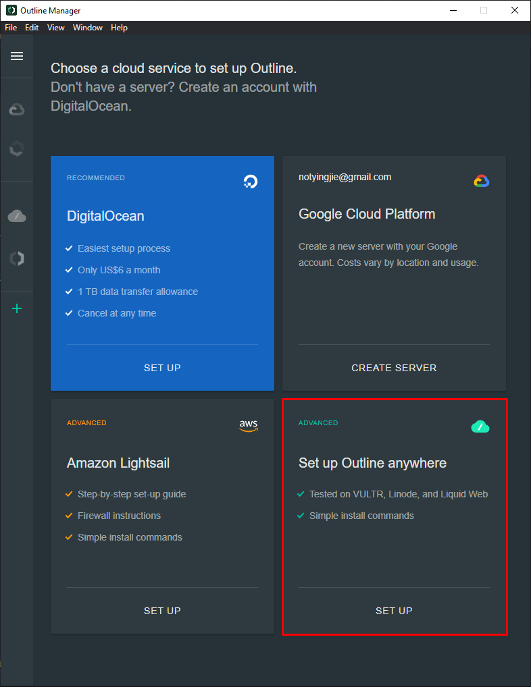
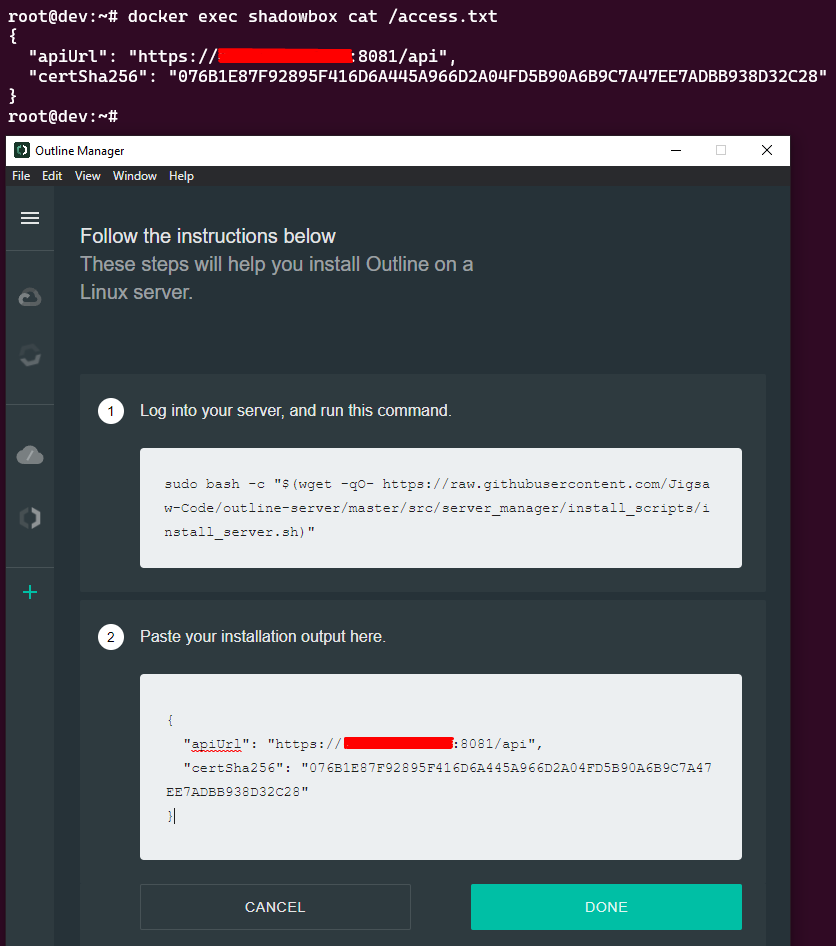

# Outline-VPN-docker

Repository containing a multi-platform shadowbox docker image to run in a generic docker-compose.yml file.

**CURRENTLY USABLE, BUT SOMEWHAT BROKEN! Metrics are currently broken in the current build, but you should still be able to connect to the shadowsocks service.** Images are currently tagged as `diffusehyperion/outline-vpn:beta` until this is fixed.

**ARM IS ALSO NOT AVAILABLE ATM, will fix soon**

I also have no clue if watchtower is actually working lol

## Usage
1. You will need to install [Outline Manager](https://getoutline.org/get-started/#step-1) first.

2. After installing, click on "Set up Outline Anywhere".

</img>

3. Run the below compose stack on your server:

```
services:
  shadowbox:
    image: diffusehyperion/outline-vpn:beta
    container_name: shadowbox
    restart: unless-stopped
    volumes:
      - shadowbox-state:/shadowbox/state
    environment:
      - SB_STATE_DIR=/shadowbox/state
      - SB_API_PREFIX=api
      - SB_CERTIFICATE_FILE=/shadowbox/state/shadowbox-selfsigned.crt
      - SB_PRIVATE_KEY_FILE=/shadowbox/state/shadowbox-selfsigned.key
    labels:
      - com.centurylinklabs.watchtower.enable=true
    ports:
      - 8081:8081
      - 8082:8082
      - 8082:8082/udp
      - 9090-9092:9090-9092
  watchtower:
    image: containrrr/watchtower
    container_name: watchtower
    restart: unless-stopped
    volumes:
      - /var/run/docker.sock:/var/run/docker.sock:ro
 
networks:
  default:
    name: outline-vpn

volumes:
  shadowbox-state:
    name: shadowbox-state
```

4. Run `docker exec shadowbox cat /access.txt`.

5. Copy the output into Outline Manager.

</img>

6. Proceed with normal installation.

# Outline Server (Shadowbox)

The Outline Server, internal name "Shadowbox," is designed to streamline the setup and sharing of Shadowsocks servers. It includes a user management API and creates Shadowsocks instances when needed. It's managed by the [Outline Manager](https://github.com/Jigsaw-Code/outline-apps/) and used as proxy by the [Outline Client](https://github.com/Jigsaw-Code/outline-apps/) apps. Shadowbox is also compatible with standard Shadowsocks clients.

## Installation

### Self-Hosted Installation

1. **Run the Installation Script**

   ```sh
   sudo bash -c "$(wget -qO- https://raw.githubusercontent.com/Jigsaw-Code/outline-apps/master/server_manager/install_scripts/install_server.sh)"
   ```

1. **Customize (Optional)**

   Add flags for hostname, port, etc. Example:

   ```sh
   sudo bash -c "$(wget -qO- https://raw.githubusercontent.com/Jigsaw-Code/outline-apps/master/server_manager/install_scripts/install_server.sh)" install_server.sh \
     --hostname=myserver.com \
     --keys-port=443
   ```

   - Use `sudo --preserve-env` for environment variables.
   - Use `bash -x` for debugging.

### Running from Source Code

**Prerequisites**

- [Docker](https://docs.docker.com/engine/install/)
- [Node](https://nodejs.org/en/download/) LTS (`lts/hydrogen`, version `18.16.0`)
- [NPM](https://docs.npmjs.com/downloading-and-installing-node-js-and-npm) (version `9.5.1`)

> [!TIP]
> If you use `nvm`, switch to the correct Node version with `nvm use`.

1. **Build and Run:**

   Shadowbox supports running on linux and macOS hosts.

   - **Node.js App**

     ```sh
     task shadowbox:start
     ```

   - **Docker Container**

     ```sh
     task shadowbox:docker:start
     ```

     > [!TIP]
     > Some useful commands when working with Docker images and containers:
     >
     > - **Debug Image:**
     >
     >   ```sh
     >   docker run --rm -it --entrypoint=sh localhost/outline/shadowbox
     >   ```
     >
     > - **Debug Running Container:**
     >
     >   ```sh
     >   docker exec -it shadowbox sh
     >   ```
     >
     > - **Cleanup Dangling Images:**
     >
     >   ```sh
     >   docker rmi $(docker images -f dangling=true -q)
     >   ```

1. **Send a Test Request**

   ```sh
   curl --insecure https://[::]:8081/TestApiPrefix/server
   ```

## Access Keys Management API

The Outline Server provides a REST API for access key management. If you know the `apiUrl` of your Outline Server (e.g. `https://1.2.3.4:1234/3pQ4jf6qSr5WVeMO0XOo4z`), you can directly manage the server's access keys using HTTP requests:

1. **Find the Server's `apiUrl`:**

   - **Deployed with the Installation Script:** Run `grep "apiUrl" /opt/outline/access.txt | cut -d: -f 2-`

   - **Deployed with the Outline Manager:** Check the "Settings" tab.

   - **Local Deployments from Source:** `https://[::]:8081/TestApiPrefix`

1. **API Examples:**

   Replace `$API_URL` with your actual `apiUrl`.

   - **List access keys:** `curl --insecure $API_URL/access-keys/`

   - **Create an access key:** `curl --insecure -X POST $API_URL/access-keys`

   - **Get an access key (e.g. ID 1):** `curl --insecure $API_URL/access-keys/1`

   - **Rename an access key:** `curl --insecure -X PUT -F 'name=albion' $API_URL/access-keys/2/name`

   - **Remove an access key:** `curl --insecure -X DELETE $API_URL/access-keys/1`

   - **Set a data limit for all access keys:** (e.g. limit outbound data transfer access keys to 1MB over 30 days) `curl --insecure -X PUT -H "Content-Type: application/json" -d '{"limit": {"bytes": 1000}}' $API_URL/server/access-key-data-limit`

   - **Remove the access key data limit:** `curl --insecure -X DELETE $API_URL/server/access-key-data-limit`

   - **And more...**

1. **Further Options:**

   Consult the [OpenAPI spec](./server/api.yml) and [documentation](https://redocly.github.io/redoc/?url=https://raw.githubusercontent.com/Jigsaw-Code/outline-server/master/src/shadowbox/server/api.yml) for more options.

## Testing

### Manual

Build and run your image with:

```sh
task shadowbox:docker:start
```

### Integration Test

The integration test will not only build and run your image, but also run a number of automated tests.

```sh
task shadowbox:integration_test
```

This does the following:

- Sets up three containers (`client`, `shadowbox`, `target`) and two networks.
- Creates a user on `shadowbox`.
- Connects to `target` through `shadowbox` using a Shadowsocks `client`: `client <-> shadowbox <-> target`

1. **Testing Changes to the Server Config:**

If your change includes new fields in the server config which are needed at server start-up time, then you mey need to remove the pre-existing test config:

- **Delete Existing Config:** `rm /tmp/outline/persisted-state/shadowbox_server_config.json`

- **Manually Edit:** You'll need to edit the JSON string within [`src/shadowbox/docker/start.action.sh`](src/shadowbox/docker/start.action.sh).
